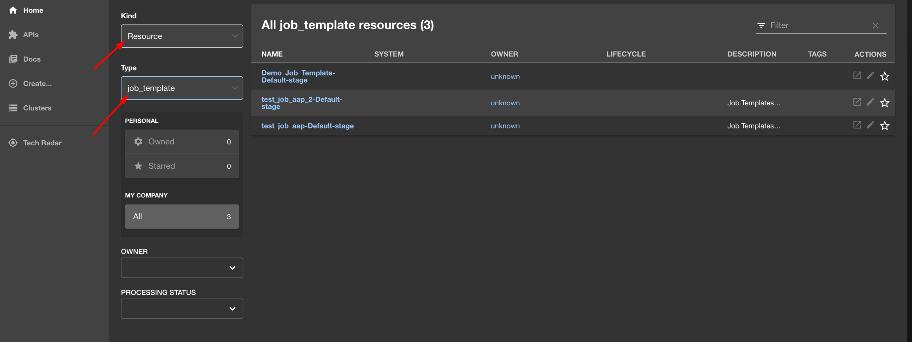
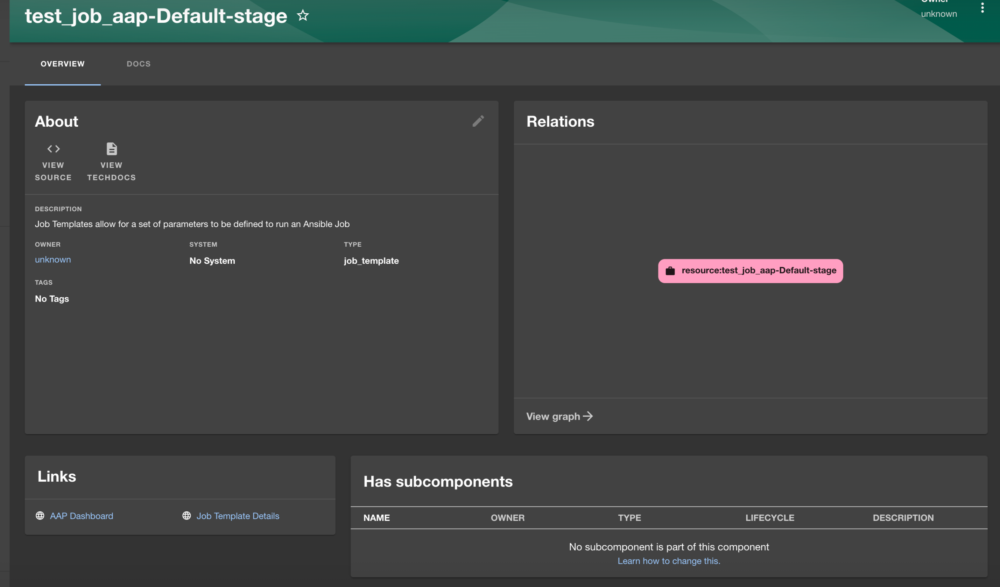

# Ansible Automation Platform Backstage provider plugin

The Ansible Automation Platform (AAP) Backstage provider plugin synchronizes the accessible templates including job templates and workflow job templates from AAP into the [Backstage](https://backstage.io/) catalog.

## For administrators

### Installation and configuration

The AAP Backstage provider plugin allows the configuration of one or multiple providers using the `app-config.yaml` configuration file of Backstage.

#### Procedure

1. Run the following command to install the AAP Backstage provider plugin:

   ```console
   yarn workspace backend add @janus-idp/backstage-plugin-aap-backend
   ```

1. Use `aap` marker to configure the `app-config.yaml` file of Backstage as follows:

   ```yaml title="app-config.yaml"
   catalog:
     providers:
       aap:
         dev:
           baseUrl: <URL>
           authorization: 'Bearer ${AAP_AUTH_TOKEN}'
           owner: <owner>
           system: <system>
           schedule: # optional; same options as in TaskScheduleDefinition
             # supports cron, ISO duration, "human duration" as used in code
             frequency: { minutes: 1 }
             # supports ISO duration, "human duration" as used in code
             timeout: { minutes: 1 }
   ```

1. Configure the scheduler using one of the following options:

   - **Method 1**: If the scheduler is configured inside the `app-config.yaml` using the schedule config key mentioned previously, add the following code to `packages/backend/src/plugins/catalog.ts` file:

     ```ts title="packages/backend/src/plugins/catalog.ts"
     /* highlight-add-next-line */
     import { AapResourceEntityProvider } from '@janus-idp/backstage-plugin-aap-backend';

     export default async function createPlugin(
       env: PluginEnvironment,
     ): Promise<Router> {
       const builder = await CatalogBuilder.create(env);

       /* ... other processors and/or providers ... */
       /* highlight-add-start */
       builder.addEntityProvider(
         AapResourceEntityProvider.fromConfig(env.config, {
           logger: env.logger,
           scheduler: env.scheduler,
         }),
       );
       /* highlight-add-end */

       const { processingEngine, router } = await builder.build();
       await processingEngine.start();
       return router;
     }
     ```

     ***

     **NOTE**

     If you have made any changes to the schedule in the `app-config.yaml` file, then restart to apply the changes.

     ***

   - **Method 2**: Add a schedule directly inside the `packages/backend/src/plugins/catalog.ts` file as follows:

     ```ts title="packages/backend/src/plugins/catalog.ts"
     /* highlight-add-next-line */
     import { AapResourceEntityProvider } from '@janus-idp/backstage-plugin-aap-backend';

     export default async function createPlugin(
       env: PluginEnvironment,
     ): Promise<Router> {
       const builder = await CatalogBuilder.create(env);

       /* ... other processors and/or providers ... */
       /* highlight-add-start */
       builder.addEntityProvider(
         AapResourceEntityProvider.fromConfig(env.config, {
           logger: env.logger,
           schedule: env.scheduler.createScheduledTaskRunner({
             frequency: { minutes: 1 },
             timeout: { minutes: 1 },
           }),
         }),
       );
       /* highlight-add-end */

       const { processingEngine, router } = await builder.build();
       await processingEngine.start();
       return router;
     }
     ```

   ***

   **NOTE**

   If both the `schedule` (hard-coded schedule) and `scheduler` (`app-config.yaml` schedule) option are provided in the `packages/backend/src/plugins/catalog.ts`, the `scheduler` option takes precedence. However, if the schedule inside the `app-config.yaml` file is not configured, then the `schedule` option is used.

   ***

### Troubleshooting

When you start your Backstage application, you can see the following log lines:

```log
[1] 2023-02-13T15:26:09.356Z catalog info Discovered ResourceEntity API type=plugin target=AapResourceEntityProvider:dev
[1] 2023-02-13T15:26:09.423Z catalog info Discovered ResourceEntity Red Hat Event (DEV, v1.2.0) type=plugin target=AapResourceEntityProvider:dev
[1] 2023-02-13T15:26:09.620Z catalog info Discovered ResourceEntity Red Hat Event (TEST, v1.1.0) type=plugin target=AapResourceEntityProvider:dev
[1] 2023-02-13T15:26:09.819Z catalog info Discovered ResourceEntity Red Hat Event (PROD, v1.1.0) type=plugin target=AapResourceEntityProvider:dev
[1] 2023-02-13T15:26:09.819Z catalog info Applying the mutation with 3 entities type=plugin target=AapResourceEntityProvider:dev
```

## For users

### Accessing templates from Ansible Automation Platform in Backstage

Once the AAP Backstage provider plugin is configured successfully, it synchronizes the templates including job templates and workflow job templates from AAP and displays them on the Backstage Catalog page as Resources.

#### Prerequisites

- Your Backstage application is installed and running.
- You have installed the AAP Backstage provider plugin. For installation and configuration instructions, see [Installation and configuration](#installation-and-configuration).

#### Procedure

1. Open your Backstage application and Go to the **Catalog** page.
1. Select **Resource** from the **Kind** drop-down and **job template** or **workflow job template** from the **Type** drop-down on the left side of the page.

   

   A list of all the available templates from AAP appears on the page.

1. Select a template from the list.

   The **OVERVIEW** tab appears containing different cards, such as:

   - **About**: Provides detailed information about the template.
   - **Relations**: Displays the visual representation of the template and associated aspects.
   - **Links**: Contains links to the AAP dashboard and the details page of the template.
   - **Has subcomponents**: Displays a list of associated subcomponents.

     
