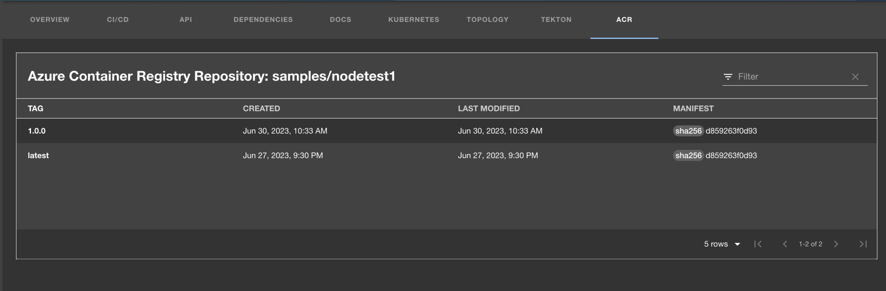

# Azure Container Registry plugin for Backstage

The Azure Container Registry (ACR) plugin displays information about your container images available in the Azure Container Registry.

## For administrators

### Installing and configuring the ACR plugin

1. Run the following command to install the ACR plugin:

   ```bash
   yarn workspace app add @janus-idp/backstage-plugin-acr
   ```

1. Set the proxy to the desired ACR server in the `app-config.yaml` file as follows:

   ```yaml
   # app-config.yaml
   proxy:
     '/acr/api':
       target: 'https://mycontainerregistry.azurecr.io/acr/v1/'
       changeOrigin: true
       headers:
         # If you use Bearer Token for authorization, please replace the 'Basic' with 'Bearer' in the following line.
         Authorization: 'Basic ${ACR_AUTH_TOKEN}'
       # Change to "false" in case of using self hosted artifactory instance with a self-signed certificate
       secure: true
   ```

1. Set the authorization using one of the following options:

   - Basic authorization:

     - Navigate to the ACR portal and go to the **Access Keys** tab.
     - Retrieve the username and password of the Admin user and use the Basic Auth Header Generator tool to convert the credentials into a token.
     - Set the generated token as `ACR_AUTH_TOKEN` in environment variables.

   - OAuth2:
     - Generate bearer access token using the process described in Authenticate with an Azure Container Registry.
     - Set the generated token as `ACR_AUTH_TOKEN` in environment variables.

1. Enable an additional tab on the entity view page using the `packages/app/src/components/catalog/EntityPage.tsx` file as follows:

   ```tsx title="packages/app/src/components/catalog/EntityPage.tsx"
   /* highlight-add-start */
   import { AcrPage, isAcrAvailable } from '@janus-idp/backstage-plugin-acr';

   /* highlight-add-end */

   const serviceEntityPage = (
     <EntityPageLayout>
       // ...
       {/* highlight-add-start */}
       <EntityLayout.Route path="/acr" title="ACR">
         <Grid container spacing={3} alignItems="stretch">
           <EntitySwitch>
             <EntitySwitch.Case if={e => Boolean(isAcrAvailable(e))}>
               <Grid item sm={12}>
                 <AcrPage />
               </Grid>
             </EntitySwitch.Case>
           </EntitySwitch>
         </Grid>
       </EntityLayout.Route>
       {/* highlight-add-end */}
     </EntityPageLayout>
   );
   ```

1. Annotate your entity using the following annotations:
   ```yaml
   metadata:
     annotations:
       'azure-container-registry/repository-name': `<REPOSITORY-NAME>',
   ```

### Development

The ACR plugin is a front-end plugin. You can use the following command to start the live development session from your root repository:

```
yarn workspace @janus-idp/backstage-plugin-acr run start
```

## For users

### Using the ACR plugin in Backstage

ACR is a front-end plugin that enables you to view information about the container images from your Azure Container Registry in Backstage.

#### Prerequisites

- Your Backstage application is installed and running.
- You have installed the ACR plugin. For installation instructions, see [Installing and configuring the ACR plugin](#installing-and-configuring-the-acr-plugin).

#### Procedure

1. Open your Backstage application and select a component from the Catalog page.

1. Go to the **ACR** tab.

   

   The **ACR** tab in the Backstage UI contains a list of container images and related information, such as **TAG**, **CREATED**, **LAST MODIFIED**, and **MANIFEST**.
