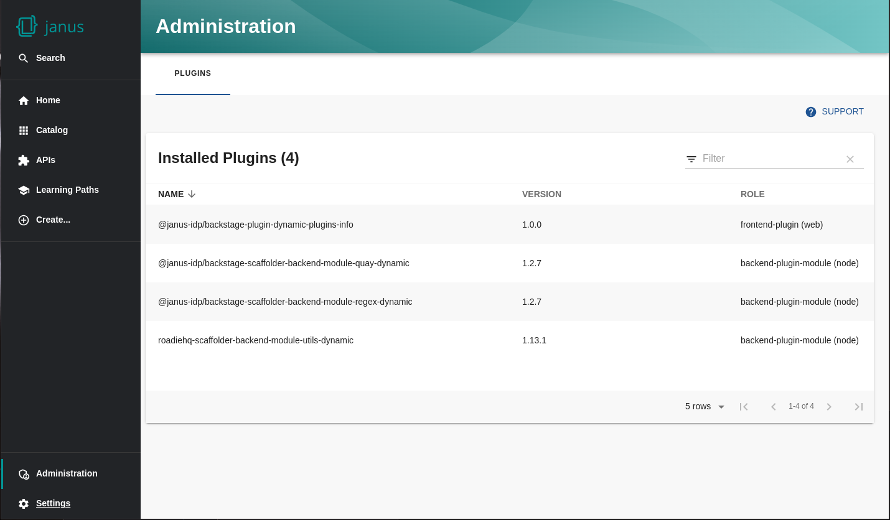

# Dynamic Plugins Info plugin for Backstage

The dynamic-plugins-info plugin is a frontend component for the [dynamic-plugins-info-backend](https://github.com/janus-idp/backstage-showcase/tree/main/plugins/dynamic-plugins-info-backend) plugin. It offers a simple table of plugins that are currently installed in Red Hat Developer Hub or Janus IDP that supports client-side sorting, filtering and pagination.



The plugin is designed to be installed dynamically in the [backstage-showcase](https://github.com/janus-idp/backstage-showcase/tree/main) app.

## Installing via Helm

To install this plugin into Red Hat Developer Hub or Janus IDP via Helm use this configuration:

```yaml
global:
  dynamic:
    includes:
      - dynamic-plugins.default.yaml
    plugins:
      - package: ./dynamic-plugins/dist/janus-idp-backstage-plugin-dynamic-plugins-info
        disabled: false
```

## Building and installing locally

To build this plugin and the dynamic entrypoint:

`yarn install`

`yarn tsc`

`yarn build`

`yarn export-dynamic`

To install the dynamic plugin from a local build and run it in a local instance of [backstage-showcase](https://github.com/janus-idp/backstage-showcase/tree/main):

```bash
cd dist-scalprum
npm pack .
archive=$(npm pack $pkg)
tar -xzf "$archive" && rm "$archive"
mv package $(echo $archive | sed -e 's:\.tgz$::')
```

Move the resulting directory (`janus-idp-backstage-plugin-dynamic-plugins-info-0.1.0`) into the `dynamic-plugins-root` folder of your [backstage-showcase](https://github.com/janus-idp/backstage-showcase/tree/main) clone, then run `yarn start` to start the app.

This configuration will then enable the plugin to be visible in the UI:

```yaml
dynamicPlugins:
  frontend:
    janus-idp.backstage-plugin-dynamic-plugins-info:
      dynamicRoutes:
        - path: /admin/plugins
          importName: DynamicPluginsInfo
      mountPoints:
        - mountPoint: admin.page.plugins/cards
          importName: DynamicPluginsInfo
          config:
            layout:
              gridColumn: '1 / -1'
              width: 100vw
```
