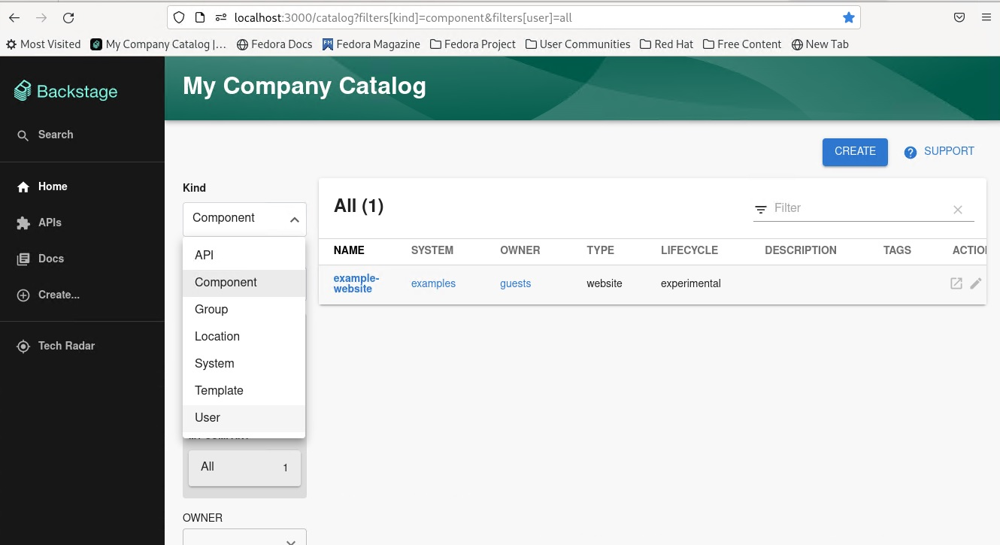
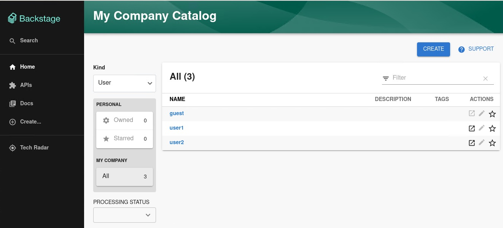
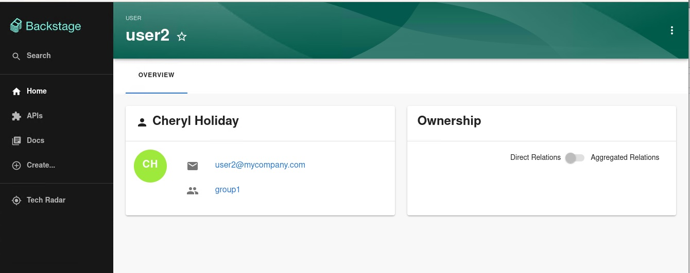
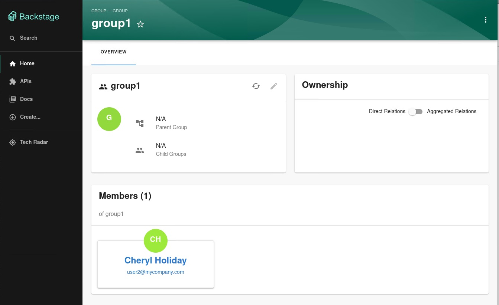

# Keycloak backend plugin for Backstage

The Keycloak backend plugin integrates Keycloak into Backstage.

## Capabilities

The Keycloak backend plugin has the following capabilities:

- Synchronization of Keycloak users in a realm
- Synchronization of Keycloak groups and their users in a realm

# Table of contents

1. [For administrators](#for-administrators)

   a. [Configuration](#configuration)

   b. [Installation](#installation)

   c. [Limitations](#limitations)

1. [For users](for-users)

   a. [Imported users and groups in Backstage with Keycloak plugin](#imported-users-and-groups-in-backstage-with-keycloak-plugin)

## For administrators

### Configuration

Communication between Backstage and Keycloak is enabled by using the Keycloak API. Username/password or client credentials are supported authentication methods.

The following table describes the parameters that you can configure to enable the plugin under `catalog.providers.keycloakOrg.<ENVIRONMENT_NAME>` object in the `app-config.yaml` file:

| Name             | Description                                                                                                                                     | Default Value | Required                                             |
| ---------------- | ----------------------------------------------------------------------------------------------------------------------------------------------- | ------------- | ---------------------------------------------------- |
| `baseUrl`        | Location of the Keycloak server, such as `https://localhost:8443/auth`. Note that the newer versions of Keycloak omit the `/auth` context path. | ""            | Yes                                                  |
| `realm`          | Realm to synchronize                                                                                                                            | `master`      | No                                                   |
| `loginRealm`     | Realm used to authenticate                                                                                                                      | `master`      | No                                                   |
| `username`       | Username to authenticate                                                                                                                        | ""            | Yes if using password based authentication           |
| `password`       | Password to authenticate                                                                                                                        | ""            | Yes if using password based authentication           |
| `clientId`       | Client ID to authenticate                                                                                                                       | ""            | Yes if using client credentials based authentication |
| `clientSecret`   | Client Secret to authenticate                                                                                                                   | ""            | Yes if using client credentials based authentication |
| `userQuerySize`  | Number of users to query at a time                                                                                                              | `100`         | No                                                   |
| `groupQuerySize` | Number of groups to query at a time                                                                                                             | `100`         | No                                                   |

When using client credentials, the access type must be set to `confidential` and service accounts must be enabled. You must add the following roles from the `realm-management` client role:

- `query-groups`
- `query-users`
- `view-users`

### Installation

1. Install the Backstage package into the backend. When not integrating with a published package, clone the repository locally and add the Backstage as follows:

   ```shell
   # From your Backstage root directory
   yarn add --cwd packages/backend @janus-idp/backstage-plugin-keycloak-backend
   ```

2. Add the following configuration to the `app-config.yaml` file:

   ```yaml
   # app-config.yaml
   catalog:
     providers:
       keycloakOrg:
         default:
           baseUrl: https://<keycloak_host>/auth
           loginRealm: ${KEYCLOAK_REALM}
           realm: ${KEYCLOAK_REALM}
           clientId: ${KEYCLOAK_CLIENTID}
           clientSecret: ${KEYCLOAK_CLIENTSECRET}
   ```

3. Register the plugin in the `packages/backend/src/plugins/catalog.ts` file. You can also configure a schedule in this step. However there are possible ways of configuration, such as:

   - Configure a schedule inside the `app-config.yaml` file:

     ```yaml
     # app-config.yaml
     catalog:
       providers:
         keycloakOrg:
           default:
             ...
             schedule: # optional; same options as in TaskScheduleDefinition
               # supports cron, ISO duration, "human duration" as used in code
               frequency: { minutes: 1 }
               # supports ISO duration, "human duration" as used in code
               timeout: { minutes: 1 }
               initialDelay: { seconds: 15 }
     ```

     Use the configured scheduler as follows:

     ```diff
     // packages/backend/src/plugins/catalog.ts
     + import { KeycloakOrgEntityProvider } from '@janus-idp/backstage-plugin-keycloak-backend';

       export default async function createPlugin(
         env: PluginEnvironment,
       ): Promise<Router> {
         const builder = await CatalogBuilder.create(env);

     +   builder.addEntityProvider(
     +     KeycloakOrgEntityProvider.fromConfig(env.config, {
     +       id: 'development',
     +       logger: env.logger,
     +       scheduler: env.scheduler,
     +     }),
     +   )
       ...
       }
     ```

   - Add a schedule directly inside the `packages/backend/src/plugins/catalog.ts` file as follows:

     ```diff
     // packages/backend/src/plugins/catalog.ts
     + import { KeycloakOrgEntityProvider } from '@janus-idp/backstage-plugin-keycloak-backend';

       export default async function createPlugin(
         env: PluginEnvironment,
       ): Promise<Router> {
         const builder = await CatalogBuilder.create(env);

     +   builder.addEntityProvider(
     +     KeycloakOrgEntityProvider.fromConfig(env.config, {
     +       id: 'development',
     +       logger: env.logger,
     +       schedule: env.scheduler.createScheduledTaskRunner({
     +         frequency: { minutes: 1 },
     +         timeout: { minutes: 1 },
     +         initialDelay: { seconds: 15 }
     +       }),
     +     }),
     +   )
       ...
       }
     ```

4. Optionally override the default Keycloak query parameters. Configure the parameters inside the `app-config.yaml` file:

   ```yaml
   # app-config.yaml
   catalog:
     providers:
       keycloakOrg:
         default:
           ...
           userQuerySize: 500 # Optional
           groupQuerySize: 250 # Optional
   ```

### Limitations

If you have self-signed or corporate certificate issues, you can set the following environment variable before starting Backstage:

`NODE_TLS_REJECT_UNAUTHORIZED=0`

---

**NOTE**

The solution of setting the environment variable is not recommended.

---

## For users

### Imported users and groups in Backstage with Keycloak plugin

After configuring the plugin successfully, the plugin imports the users and groups each time when started.

After the first import is complete, you can select `User` to list the users from the catalog page:


You can see the list of users on the page:


When you select a user, you can see the information imported from Keycloak:


You can also select a `Group`, view the list, and select or view the information imported from Keycloak for a group:

