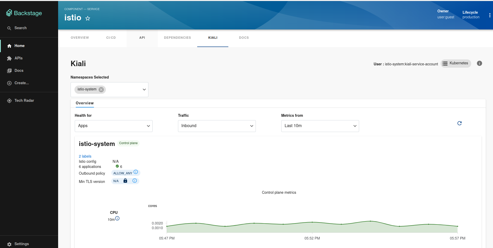

# Development environment

## Minimal Setup

1. Run `yarn install` from the project root (For the first time setup)

2. Go to plugins/kiali

3. Execute `yarn start`

4. Go to `http://localhost:3000/kiali`

## Full Setup

1. Add libraries to packages/app and packages/backend:

   - Add to packages/app/package.json

   ```yaml title="packages/app/package.json"
   "@janus-idp/backstage-plugin-kiali": "link:../../plugins/kiali",
   ```

   - Add to packages/backend/package.json

   ```yaml title="packages/backend/package.json"
   '@janus-idp/backstage-plugin-kiali-backend': 'link:../../plugins/kiali-backend'
   ```

2. Enable the **Kiali** tab on the entity view page using the `packages/app/src/components/catalog/EntityPage.tsx` file:

   ```tsx title="packages/app/src/components/catalog/EntityPage.tsx"
   /* highlight-add-next-line */
   import { EntityKialiContent } from '@janus-idp/backstage-plugin-kiali';

   const serviceEntityPage = (
     <EntityLayout>
       {/* ... */}
       {/* highlight-add-start */}
       <EntityLayout.Route path="/kiali" title="kiali">
         <EntityKialiContent />
       </EntityLayout.Route>
       {/* highlight-add-end */}
     </EntityLayout>
   );
   ```

3. Create a file called `kiali.ts` inside `packages/backend/src/plugins/` and add the following:

```ts
/* highlight-add-start */
import { Router } from 'express';

import { createRouter } from '@janus-idp/backstage-plugin-kiali-backend';

import { PluginEnvironment } from '../types';

export default async function createPlugin(
  env: PluginEnvironment,
): Promise<Router> {
  return await createRouter({
    logger: env.logger,
    config: env.config,
  });
}
/* highlight-add-end */
```

5. import the plugin to `packages/backend/src/index.ts`. There are three lines of code you'll need to add, and they should be added near similar code in your existing Backstage backend.

```typescript title="packages/backend/src/index.ts"
// ..
/* highlight-add-next-line */
import kiali from './plugins/kiali';

async function main() {
  // ...
  /* highlight-add-next-line */
  const kialiEnv = useHotMemoize(module, () => createEnv('kiali'));
  // ...
  /* highlight-add-next-line */
  apiRouter.use('/kiali', await kiali(kialiEnv));
```

6. Configure you `app-config.local.yaml` with kiali configuration


```yaml
catalog:
  providers:
    # highlight-add-start
    kiali:
      # Required. Kiali endpoint
      url: ${KIALI_ENDPOINT}
      # Optional. Required by token authentication
      serviceAccountToken: ${KIALI_SERVICE_ACCOUNT_TOKEN}
      # Optional. defaults false
      skipTLSVerify: true
      # Optional
      caData: ${KIALI_CONFIG_CA_DATA}
      # Optional. Local path to CA file
      caFile: ''
      # Optional. Time in seconds that session is enabled, defaults to 1 minute.
      sessionTime: 60
      # highlight-add-end
```

7. Add catalog

Add to locations in `app-config.local.yaml`

```yaml
locations:
  # Local example data for Kiali plugin
  - type: file
    target: ../../plugins/kiali/catalog-demo.yaml
```

8. Run `yarn start:backstage` from the project root.
9. After create a new component, the Kiali tab should be enabled:



## Configure auth

### Token authentication

1. Set the parameters in app-config.local.yaml

```yaml
catalog:
  providers:
    # highlight-add-start
    kiali:
      # Required. Kiali endpoint
      url: ${KIALI_ENDPOINT}
      # Optional. Required by token authentication
      serviceAccountToken: ${KIALI_SERVICE_ACCOUNT_TOKEN}
      # Optional. defaults false
      skipTLSVerify: true
      # Optional
```

2. To get `KIALI_SERVICE_ACCOUNT_TOKEN` create your service account and create the token

```bash
kubectl create token $KIALI_SERVICE_ACCOUNT
```

or if you installed kiali with the operator then execute

```bash
export KIALI_SERVICE_ACCOUNT_TOKEN=$(kubectl describe secret $(kubectl get secret -n istio-system | grep kiali-service-account-token | cut -d" " -f1) -n istio-system | grep token: | cut -d ":" -f2 | sed 's/^ *//')
```
