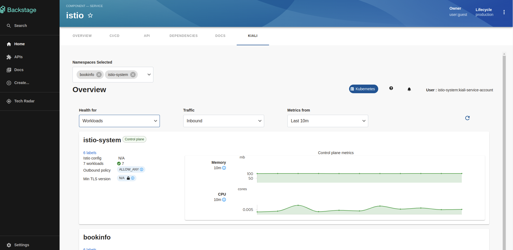

# kiali

Welcome to the kiali plugin!

This plugin exposes information about your entity-specific ServiceMesh objects.

## For administrators

### Setting up the Kiali plugin

#### Prerequisites

- The following annotation is added to the entity's `catalog-info.yaml` file to identify whether an entity contains the Kubernetes resources:

  ```yaml
  annotations:
    ...

    backstage.io/kubernetes-id: <BACKSTAGE_ENTITY_NAME>
  ```

  You can also add the `backstage.io/kubernetes-namespace` annotation to identify the Kubernetes resources using the defined namespace.

  ```yaml
  annotations:
    ...

    backstage.io/kubernetes-namespace: <RESOURCE_NS>
  ```

- The following annotation is added to the `catalog-info.yaml` file of entity to view the latest `PipelineRun` in the CI/CD tab of the application:

  ```yaml
  annotations:
    ...

    janus-idp.io/kiali-enabled : 'true'
  ```

- A custom label selector can be added, which Backstage uses to find the Kubernetes resources. The label selector takes precedence over the ID annotations.

  ```yaml
  annotations:
    ...

    backstage.io/kubernetes-label-selector: 'app=my-app,component=front-end'
  ```

- The following label is added to the resources so that the Kubernetes plugin gets the Kubernetes resources from the requested entity:

  ```yaml
  labels:
    ...

    backstage.io/kubernetes-id: <BACKSTAGE_ENTITY_NAME>`
  ```

  ***

  **NOTE**

  When using the label selector, the mentioned labels must be present on the resource.

  ***

#### Procedure

1. Install the Kiali plugin using the following commands:

   ```console
   yarn workspace app add @janus-idp/backstage-plugin-kiali
   yarn workspace app add @janus-idp/backstage-plugin-kiali-backend
   ```

2. Enable the **Kiali** tab on the entity view page using the `packages/app/src/components/catalog/EntityPage.tsx` file:

   ```tsx title="packages/app/src/components/catalog/EntityPage.tsx"
   /* highlight-add-next-line */
   import { EntityKialiContent } from '@janus-idp/backstage-plugin-kiali';

   const serviceEntityPage = (
     <EntityPageLayout>
       {/* ... */}
       {/* highlight-add-start */}
       <EntityLayout.Route path="/kiali" title="kiali">
         <EntityKialiContent />
       </EntityLayout.Route>
       {/* highlight-add-end */}
     </EntityPageLayout>
   );
   ```

3. Create a file called `kiali.ts` inside `packages/backend/src/plugins/` and add the following:

```ts
import { Router } from 'express';

import { createRouter } from '@janus-idp/plugin-kiali-backend';

import { PluginEnvironment } from '../types';

export default async function createPlugin(
  env: PluginEnvironment,
): Promise<Router> {
  return await createRouter({
    logger: env.logger,
    config: env.config,
  });
}
```

4. import the plugin to `packages/backend/src/index.ts`. There are three lines of code you'll need to add, and they should be added near similar code in your existing Backstage backend.

```typescript title="packages/backend/src/index.ts"
// ..
/* highlight-add-next-line */
import kiali from './plugins/kiali';

async function main() {
  // ...
  /* highlight-add-next-line */
  const kialiEnv = useHotMemoize(module, () => createEnv('kiali'));
  // ...
  /* highlight-add-next-line */
  apiRouter.use('/kiali', await kiali(kialiEnv));
```

5. Configure you `app-config.yaml` with kiali configuration

```yaml
catalog:
  providers:
    kiali:
      url: ${KIALI_ENDPOINT} # Required
      strategy: ${KIALI_AUTH_STRATEGY} # Required
      skipTLSVerify: true # Optional
      caData: ${KIALI_CONFIG_CA_DATA} # Optional
      caFile: '' # local path to CA file
      serviceAccountToken: ${KIALI_SERVICE_ACCOUNT_TOKEN} # Optional
```

Authentication methods:

- anonymous [Read docs about this authentication in kiali.io](https://kiali.io/docs/configuration/authentication/anonymous/)
- token [Read docs about this authentication in kiali.io](https://kiali.io/docs/configuration/authentication/token/)

## For users

### Using the Kiali plugin in Backstage

Kiali is a front-end/back-end plugin that enables you to view your `ServiceMesh` in backstage.

#### Prerequisites

- Your Backstage application is installed and running.
- You have installed the Kiali plugin. For the installation process, see [Installation](#setting-up-the-kiali-plugin).

#### Procedure

1. Open your Backstage application and select a component from the **Catalog** page.

2. Go to the **Kiali** tab.

   The **Kiali** tab displays the Overview view associated to a Servicemesh.

   

   There is also a **Go To Kiali Graph** option at the bottom of each card, which redirects you to the **Graph in the Kiali Standalone**.
