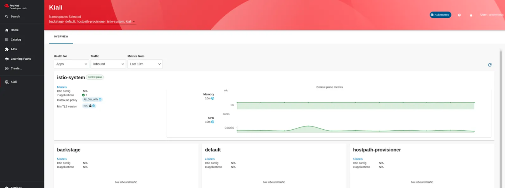
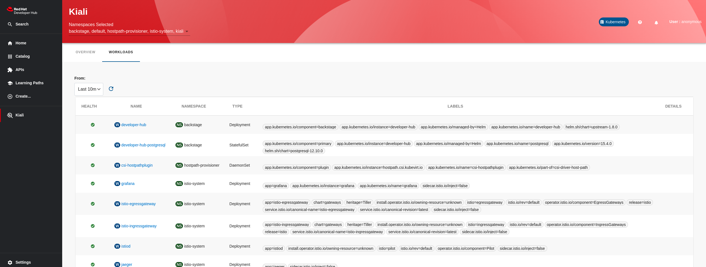

# Kiali Plugin in Red Hat Developer hub

The Kiali plugin is in the Red Hat Developer Hub for OpenShift users of Istio/OSSM. It is Technology Preview and provides early access to potential product features, enabling users to test features and provide feedback during the development process. Because this is a brand new offering, there are some things you should consider:

It is based on the new dynamic plugin-in framework.
Because it is currently a Technology Preview, we are not yet ready to provide official support, and it is not subject Red Hat production service level agreements (SLAs).
With that said, the Kiali team hopes that the community will try out the new Kiali Plugin in Red Hat Developer Hub and provide feedback. We thank you for joining the effort to provide Kiali/Service Mesh observability features directly to the Red Hat Developer Hub.

## Install

To install Kiali we need to modify the helm chart and add these values under global > dynamic > plugins

```yaml
global:
  dynamic:
    includes:
      - dynamic-plugins.default.yaml
    plugins:
      - disabled: false
        integrity: <Checksum>
        package: '@janus-idp/backstage-plugin-kiali@<version>'
        pluginConfig:
          dynamicPlugins:
            frontend:
              janus-idp.backstage-plugin-kiali:
                appIcons:
                  - importName: KialiIcon
                    name: kialiIcon
                dynamicRoutes:
                  - importName: KialiPage
                    menuItem:
                      icon: kialiIcon
                      text: Kiali
                    path: /kiali
      - disabled: falseName of the contact in Engineering
        integrity: <Checksum>
        package: '@janus-idp/backstage-plugin-kiali-backend-dynamic@<version>'
        pluginConfig:
          catalog:
            providers:
              kiali:
                skipTLSVerify: true
                url: '${KIALI_ENDPOINT}'
                serviceAccountToken: '${KIALI_SERVICE_ACCOUNT_TOKEN}'
```

_integrity: required for external packages) An integrity checksum in the format of <alg>-<digest> specific to the package. Supported algorithms include sha256, sha384, and sha512._

We can calculate the integrity with the next bash commands (Example with version 1.9.0).

```bash

npm pack @janus-idp/backstage-plugin-kiali-backend-dynamic@1.9.0
echo "sha512-$(cat janus-idp-backstage-plugin-kiali-backend-dynamic-1.9.0.tgz | openssl dgst -sha512 -binary | openssl base64 -A)"

```

_The mountPoints configuration is not available in the tech preview, we’ll use this to configure the kiali view by entity_

## Kiali Page

### Overview Page



### Workloads List



### Video Demo

[](https://youtu.be/jCExpeXl9A8)
