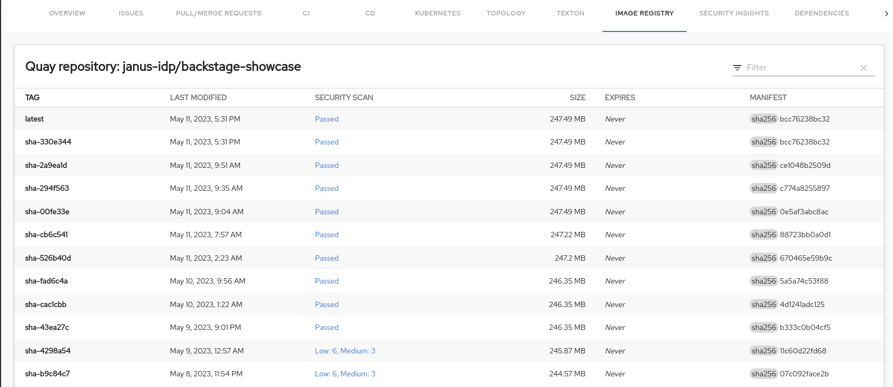
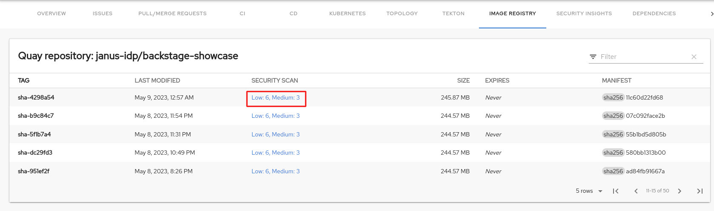
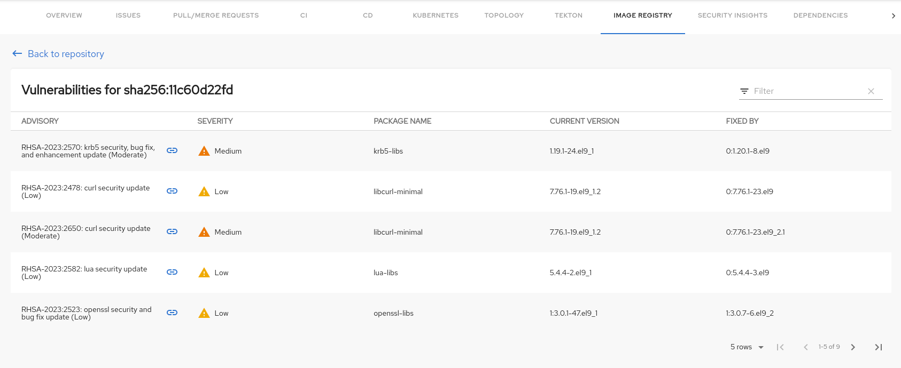

# Quay plugin for Backstage

The Quay plugin displays the information about your container images within the Quay registry in your Backstage application.

# Table of contents

1. [For administrators](#for-administrators)

   a. [Installation](#installation)

   b. [Development](#development)

1. [For users](#for-users)

   a. [Using the Quay plugin in Backstage](#using-quay-plugin-in-backstage)

## For administrators

### Installation

1. Install the Quay plugin using the following command:

   ```console
   yarn workspace app add @janus-idp/backstage-plugin-quay
   ```

2. Set the proxy to the desired Quay server in the `app-config.yaml` file as follows:

   ```yaml title="app-config.yaml"
   proxy:
     '/quay/api':
       target: 'https://quay.io'
       headers:
         X-Requested-With: 'XMLHttpRequest'
         # Uncomment the following line to access a private Quay Repository using a token
         # Authorization: 'Bearer <YOUR TOKEN>'
       changeOrigin: true
       # Change to "false" in case of using self hosted quay instance with a self-signed certificate
       secure: true

   quay:
     # The UI url for Quay, used to generate the link to Quay
     uiUrl: 'https://quay.io'
   ```

3. Enable an additional tab on the entity view page in `packages/app/src/components/catalog/EntityPage.tsx`:

   ```tsx title="packages/app/src/components/catalog/EntityPage.tsx"
   /* highlight-add-next-line */
   import { QuayPage, isQuayAvailable } from '@janus-idp/backstage-plugin-quay';

   const serviceEntityPage = (
     <EntityPageLayout>
       {/* ... */}
       {/* highlight-add-next-line */}
       <EntityLayout.Route if={isQuayAvailable} path="/quay" title="Quay">
         <QuayPage />
       </EntityLayout.Route>
     </EntityPageLayout>
   );
   ```

4. Annotate your entity with the following annotations:

   ```yaml title="catalog-info.yaml"
   metadata:
     annotations:
       'quay.io/repository-slug': `<ORGANIZATION>/<REPOSITORY>',
   ```

### Development

In [Backstage plugin terminology](https://backstage.io/docs/local-dev/cli-build-system#package-roles), the Quay plugin is a front-end plugin. However, it requires a backend proxy to be available at all times. Therefore, you need to run a backend instance in the development environment as well.

You can run the following commands concurrently from the root repository to start a live development session:

```console
yarn start-backend
```

```console
yarn workspace @janus-idp/backstage-plugin-quay run start
```

## For users

### Using the Quay plugin in Backstage

Quay is a front-end plugin that enables you to view the information about the container images.

#### Prerequisites

- Your Backstage application is installed and running.
- You have installed the Quay plugin. For installation process, see [Installation](#installation).

#### Procedure

1. Open your Backstage application and select a component from the **Catalog** page.
1. Go to the **Image Registry** tab.

   The **Image Registry** tab in the Backstage UI contains a list of container images and related information, such as **TAG**, **LAST MODIFIED**, **SECURITY SCAN**, **SIZE**, **EXPIRES**, and **MANIFEST**.

   

1. If a container image does not pass the security scan, select the security scan value of the image to check the vulnerabilities.

   

   The vulnerabilities page displays the associated advisory with a link, severity, package name, and current and fixed versions.

   

   The advisory link redirects to the Red Hat Security Advisory page that contains detailed information about the advisory, including the solution.
