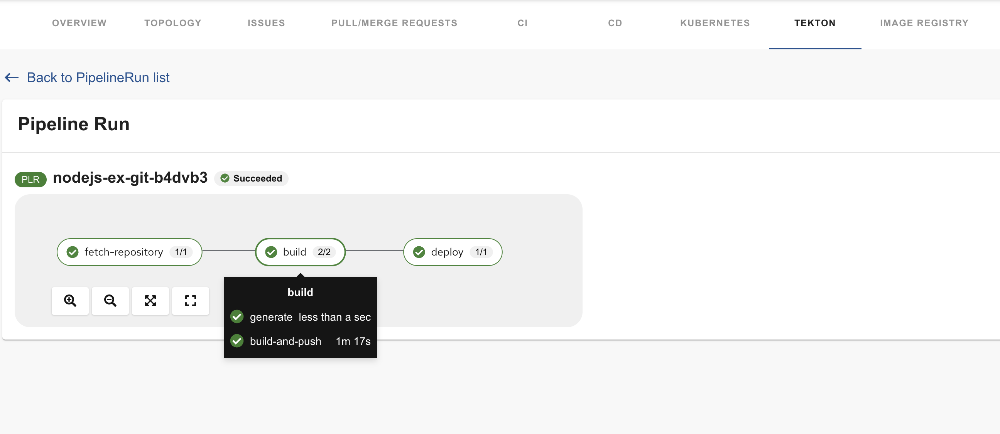
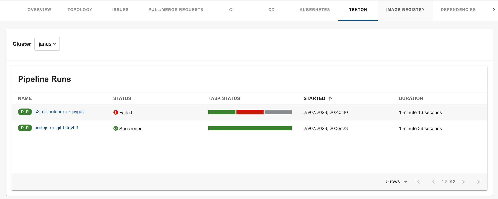

# Tekton plugin for Backstage

The Tekton plugin enables you to visualize the `PipelineRun` resources available on the Kubernetes cluster.

# Table of contents

1. [For administrators](#for-administrators)

   a. [Installation](#installation)

   b. [Development](#development)

1. [For users](#for-users)

## For administrators

### Installation

#### Prerequisites

- The Kubernetes plugins including `@backstage/plugin-kubernetes` and `@backstage/plugin-kubernetes-backend` are installed and configured by following the [installation](https://backstage.io/docs/features/kubernetes/installation) and [configuration](https://backstage.io/docs/features/kubernetes/configuration) guides.

- The following `customResources` component is added in the [`app-config.yaml`](https://backstage.io/docs/features/kubernetes/configuration#configuring-kubernetes-clusters) file:
  ```yaml
   kubernetes:
     ...
     customResources:
       - group: 'tekton.dev'
         apiVersion: 'v1beta1'
         plural: 'pipelineruns'
       - group: 'tekton.dev'
         apiVersion: 'v1beta1'
         plural: 'taskruns'
  ```
- The Kubernetes plugin is configured and connects to the cluster using a `ServiceAccount`.
- The [`ClusterRole`](https://backstage.io/docs/features/kubernetes/configuration#role-based-access-control) must be granted for custom resources (PipelineRuns and TaskRuns) to `ServiceAccount` accessing the cluster. If you have the Backstage Kubernetes Plugin configured, then the `ClusterRole` is already granted.

  You can use the following code to grant the `ClusterRole` for custom resources:

  ```yaml
  ---
    apiVersion: rbac.authorization.k8s.io/v1
    kind: ClusterRole
    metadata:
      name: backstage-read-only
    rules:
      ...
      - apiGroups:
          - tekton.dev
        resources:
          - pipelineruns
          - taskruns
        verbs:
          - get
          - list

  ```

- The following annotation is added to the entity's `catalog-info.yaml` file to identify whether an entitiy contains the Kubernetes resources:

  ```yaml
  annotations:
  backstage.io/kubernetes-id: <BACKSTAGE_ENTITY_NAME>
  ```

  You can also add the `backstage.io/kubernetes-namespace` annotation to identify the Kubernetes resources using the defined namespace.

  ```yaml
  annotations:
    backstage.io/kubernetes-namespace: <RESOURCE_NS>
  ```

- The following annotation is added to the `catalog-info.yaml` file of entity to view the latest `PipelineRun` in the CI/CD tab of the application:
  ```yaml
  annotations:
    ...
    janus-idp.io/tekton-enabled : 'true'
  ```
- A custom label selector is added, which Backstage uses to find the Kubernetes resources. The label selector takes precedence over the ID annotations.

  ```yaml
  annotations:
  ---
  backstage.io/kubernetes-label-selector: 'app=my-app,component=front-end'
  ```

- The following label is added to the resources so that the Kubernetes plugin gets the Kubernetes resources from the requested entity:

  ```yaml
  labels:
  ---
  backstage.io/kubernetes-id: <BACKSTAGE_ENTITY_NAME>`
  ```

  ***

  **NOTE**

  When using the label selector, the mentioned labels must be present on the resource.

  ***

### Procedure

1. Install the Tekton plugin using the following command:

   ```bash
   yarn workspace app add @janus-idp/backstage-plugin-tekton
   ```

2. Enable the **TEKTON** tab on the entity view page:

   ```ts
   // packages/app/src/components/catalog/EntityPage.tsx
   import { TektonPage } from '@janus-idp/backstage-plugin-tekton';

   const serviceEntityPage = (
     <EntityPageLayout>
       // ...
       <EntityLayout.Route path="/tekton" title="Tekton">
         <TektonPage />
       </EntityLayout.Route>
     </EntityPageLayout>
   );
   ```

3. Enable latest PipelineRun visualization in the **CI/CD** tab on the entity view page. The `linkTekton` prop is optional and takes boolen value, if not specified or set to `true`, then the **GO TO TEKTON** option is displayed.

   ```ts
   // packages/app/src/components/catalog/EntityPage.tsx
   import { LatestPipelineRun, isTektonCIAvailable } from '@janus-idp/backstage-plugin-tekton';

   const cicdContent = (
     <EntitySwitch>>
       // ...
      <EntitySwitch.Case if={isTektonCIAvailable}>
        <LatestPipelineRun linkTekton />
      </EntitySwitch.Case>
     </EntitySwitch>
   );
   ```

## Development

In [Backstage plugin terminology](https://backstage.io/docs/local-dev/cli-build-system#package-roles), the Tekton plugin is a front-end plugin. You can start a live development session from the repository root using the following command:

```
yarn workspace @janus-idp/backstage-plugin-tekton run start
```

## For users

### Using Tekton plugin in Backstage

Tekton is a front-end plugin that enables you to view the `PipelineRun` resources.

#### Prerequisites

- Your Backstage application is installed and running.
- You have installed the Tekton plugin. For installation process, see [Installation](#installation).

#### Procedure

1. Open your Backstage application and select a component from the **Catalog** page.
1. Go to the **CI/CD** tab.

   The **CI/CD** tab displays the latest `PipelineRun` resources associated to a Kubernetes cluster. The resources include tasks to complete, and when you hover on a task card, you can view the steps to complete that particular task.

   

   There is also a **GO TO TEKTON** option at the bottom, which redirects you to the **TEKTON** tab.

1. Click **GO TO TEKTON** or select the **TEKTON** tab in the entity view page.

   The **TEKTON** tab contains the list of pipeline runs related to a cluster. The list contains pipeline run details, such as **NAME**, **STATUS**, **TASK STATUS**, **STARTED**, and **DURATION**.

   
