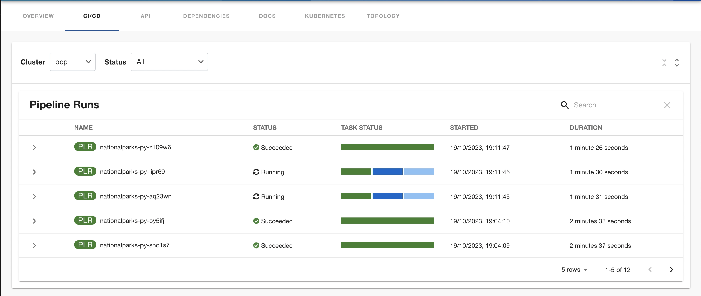
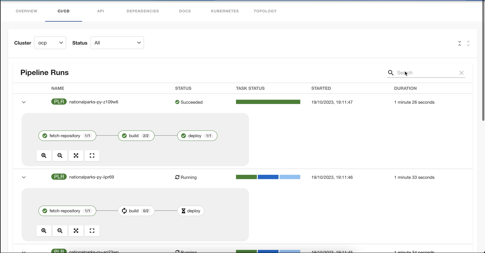

# Tekton plugin for Backstage

The Tekton plugin enables you to visualize the `PipelineRun` resources available on the Kubernetes cluster.

## For administrators

### Setting up the Tekton plugin

#### Prerequisites

- The Kubernetes plugins including `@backstage/plugin-kubernetes` and `@backstage/plugin-kubernetes-backend` are installed and configured by following the [installation](https://backstage.io/docs/features/kubernetes/installation) and [configuration](https://backstage.io/docs/features/kubernetes/configuration) guides.

- The following `customResources` component is added in the [`app-config.yaml`](https://backstage.io/docs/features/kubernetes/configuration#configuring-kubernetes-clusters) file:
  ```yaml
   kubernetes:
     ...
     customResources:
       - group: 'tekton.dev'
         apiVersion: 'v1'
         plural: 'pipelineruns'
       - group: 'tekton.dev'
         apiVersion: 'v1'
         plural: 'taskruns'
  ```
- The Kubernetes plugin is configured and connects to the cluster using a `ServiceAccount`.
- The [`ClusterRole`](https://backstage.io/docs/features/kubernetes/configuration#role-based-access-control) must be granted for custom resources (PipelineRuns and TaskRuns) to `ServiceAccount` accessing the cluster.
- To view the pod logs, you have granted permissions for `pods/log`.
- If you have the Backstage Kubernetes Plugin configured, then the `ClusterRole` is already granted.

  You can use the following code to grant the `ClusterRole` for custom resources and pod logs:

  ```yaml
    ...
    apiVersion: rbac.authorization.k8s.io/v1
    kind: ClusterRole
    metadata:
      name: backstage-read-only
    rules:
      - apiGroups:
          - ""
        resources:
          - pods/log
        verbs:
          - get
          - list
          - watch
      ...
      - apiGroups:
          - tekton.dev
        resources:
          - pipelineruns
          - taskruns
        verbs:
          - get
          - list

  ```

  > Tip: You can use the [prepared manifest for a read-only `ClusterRole`](https://raw.githubusercontent.com/janus-idp/backstage-plugins/main/plugins/tekton/manifests/clusterrole.yaml), which provides access for both Kubernetes plugin and Tekton plugin.

- The following annotation is added to the entity's `catalog-info.yaml` file to identify whether an entity contains the Kubernetes resources:

  ```yaml
  annotations:
    ...

    backstage.io/kubernetes-id: <BACKSTAGE_ENTITY_NAME>
  ```

  You can also add the `backstage.io/kubernetes-namespace` annotation to identify the Kubernetes resources using the defined namespace.

  ```yaml
  annotations:
    ...

    backstage.io/kubernetes-namespace: <RESOURCE_NS>
  ```

- The following annotation is added to the `catalog-info.yaml` file of the entity to enable the Tekton related features in Backstage. The value of the annotation identifies the name of the Backstage entity:

  ```yaml
  annotations:
    ...

    janus-idp.io/tekton : <BACKSTAGE_ENTITY_NAME>
  ```

- A custom label selector can be added, which Backstage uses to find the Kubernetes resources. The label selector takes precedence over the ID annotations.

  ```yaml
  annotations:
    ...

    backstage.io/kubernetes-label-selector: 'app=my-app,component=front-end'
  ```

- The following label is added to the resources so that the Kubernetes plugin gets the Kubernetes resources from the requested entity:

  ```yaml
  labels:
    ...

    backstage.io/kubernetes-id: <BACKSTAGE_ENTITY_NAME>`
  ```

  ***

  **NOTE**

  When using the label selector, the mentioned labels must be present on the resource.

  ***

#### Procedure

1. Install the Tekton plugin using the following command:

   ```console
   yarn workspace app add @janus-idp/backstage-plugin-tekton
   ```

1. Enable the PipelineRun list in the **CI/CD** tab on the entity view page.

   ```tsx title="packages/app/src/components/catalog/EntityPage.tsx"
   /* highlight-add-next-line */
   import {
     isTektonCIAvailable,
     TektonCI,
   } from '@janus-idp/backstage-plugin-tekton';

   const cicdContent = (
     <EntitySwitch>
       {/* ... */}
       {/* highlight-add-start */}
       <EntitySwitch.Case if={isTektonCIAvailable}>
         <TektonCI />
       </EntitySwitch.Case>
       {/* highlight-add-end */}
     </EntitySwitch>
   );
   ```

## For users

### Using the Tekton plugin in Backstage

Tekton is a front-end plugin that enables you to view the `PipelineRun` resources.

#### Prerequisites

- Your Backstage application is installed and running.
- You have installed the Tekton plugin. For the installation process, see [Installation](#setting-up-the-tekton-plugin).

#### Procedure

1. Open your Backstage application and select a component from the **Catalog** page.

1. Go to the **CI/CD** tab.

   The **CI/CD** tab displays the list of PipelineRun resources associated with a Kubernetes cluster. The list contains pipeline run details, such as **NAME**, **STATUS**, **TASK STATUS**, **STARTED**, and **DURATION**.

   

1. Click on expand row button besides PipelineRun name in the list to view the PipelineRun visualization. The pipeline run resource include tasks to complete. When you hover the mouse pointer on a task card, you can view the steps to complete that particular task.

   
