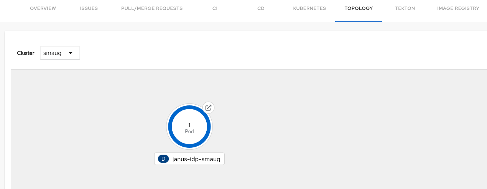
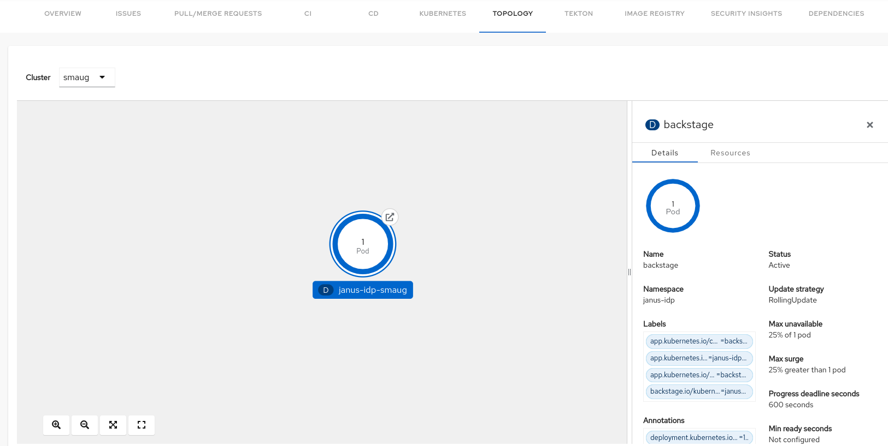
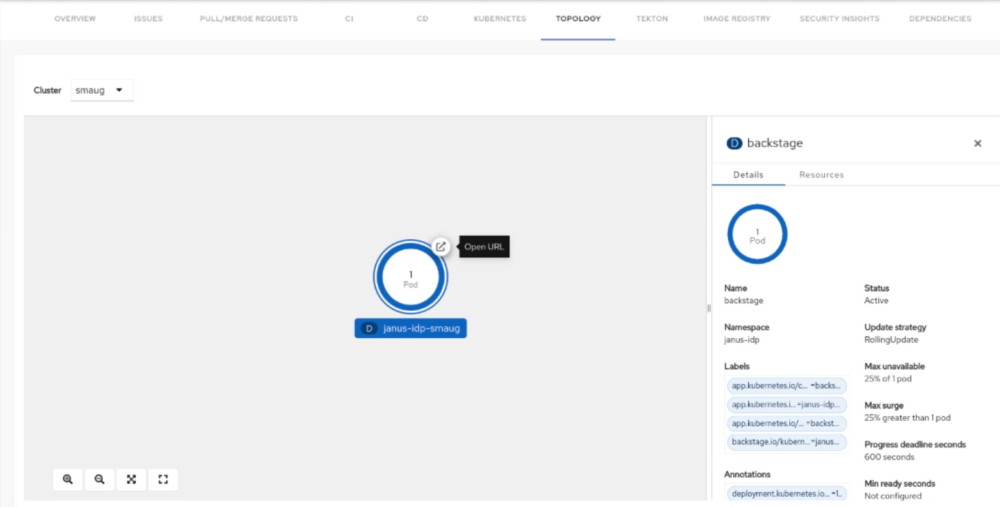

# Topology plugin for Backstage

The Topology plugin enables you to visualize the workloads such as Deployment, Job, Daemonset, Statefulset, CronJob, and Pods powering any service on the Kubernetes cluster.

## For administrators

### Installation

#### Prerequisites

- The Kubernetes plugins including `@backstage/plugin-kubernetes` and `@backstage/plugin-kubernetes-backend` are installed and configured by following the [installation](https://backstage.io/docs/features/kubernetes/installation) and [configuration](https://backstage.io/docs/features/kubernetes/configuration) guides.
- The Kubernetes plugin is configured and connects to the cluster using a `ServiceAccount`.
- The [`ClusterRole`](https://backstage.io/docs/features/kubernetes/configuration#role-based-access-control) must be granted to `ServiceAccount` accessing the cluster. If you have the Backstage Kubernetes plugin configured, then the `ClusterRole` is already granted.
- The following must be added in`customResources` component in the [`app-config.yaml`](https://backstage.io/docs/features/kubernetes/configuration#configuring-kubernetes-clusters) file to view the OpenShift route:

  ```yaml
   kubernetes:
     ...
     customResources:
       - group: 'route.openshift.io'
         apiVersion: 'v1'
         plural: 'routes'
  ```

  Also, ensure that the route is granted a [`ClusterRole`](https://backstage.io/docs/features/kubernetes/configuration#role-based-access-control). You can use the following code to grant the `ClusterRole` to the route :

  ```yaml
    ...
    apiVersion: rbac.authorization.k8s.io/v1
    kind: ClusterRole
    metadata:
      name: backstage-read-only
    rules:
      ...
      - apiGroups:
          - route.openshift.io
        resources:
          - routes
        verbs:
          - get
          - list

  ```

- The following code must be added in`customResources` component in the [`app-config.yaml`](https://backstage.io/docs/features/kubernetes/configuration#configuring-kubernetes-clusters) file to view the Tekton PipelineRuns list in side panel:

  ```yaml
   kubernetes:
     ...
     customResources:
       - group: 'tekton.dev'
         apiVersion: 'v1beta1'
         plural: 'pipelines'
       - group: 'tekton.dev'
         apiVersion: 'v1beta1'
         plural: 'pipelineruns'
  ```

  Also, ensure that the Pipeline and PipelineRun are granted a [`ClusterRole`](https://backstage.io/docs/features/kubernetes/configuration#role-based-access-control). You can use the following code to grant the `ClusterRole` to Pipeline and PipelineRun:

  ```yaml
    ...
    apiVersion: rbac.authorization.k8s.io/v1
    kind: ClusterRole
    metadata:
      name: backstage-read-only
    rules:
      ...
      - apiGroups:
          - tekton.dev
        resources:
          - pipelines
          - pipelineruns
        verbs:
          - get
          - list

  ```

  > Tip: You can use our [prepared manifest for a read-only `ClusterRole`](https://raw.githubusercontent.com/janus-idp/backstage-plugins/main/plugins/topology/manifests/clusterrole.yaml), providing both Kubernetes plugin andd Topology plugin access.

- The following annotation is added to the entity's `catalog-info.yaml` file to identify whether an entitiy contains the Kubernetes resources:

  ```yaml title="catalog-info.yaml"
  annotations:
  backstage.io/kubernetes-id: <BACKSTAGE_ENTITY_NAME>
  ```

  You can also add the `backstage.io/kubernetes-namespace` annotation to identify the Kubernetes resources using the defined namespace.

  ```yaml title="catalog-info.yaml"
  annotations:
    backstage.io/kubernetes-namespace: <RESOURCE_NS>
  ```

- A custom label selector is added, which Backstage uses to find the Kubernetes resources. The label selector takes precedence over the ID annotations.

  ```yaml title="catalog-info.yaml"
  annotations:
    backstage.io/kubernetes-label-selector: 'app=my-app,component=front-end'
  ```

- The following label is added to the resources so that the Kubernetes plugin gets the Kubernetes resources from the requested entity:

  ```yaml title="catalog-info.yaml"
  labels:
    backstage.io/kubernetes-id: <BACKSTAGE_ENTITY_NAME>`
  ```

  ***

  **NOTE**

  When using the label selector, the mentioned labels must be present on the resource.

  ***

- The following label is added to display the workload resources such as Deployments and Pods in a visual group:

  ```yaml title="catalog-info.yaml"
  labels:
    app.kubernetes.io/part-of: <GROUP_NAME>
  ```

- The following annotation is added to display the workload resources such as Deployments and Pods with a visual connector:

  ```yaml title="catalog-info.yaml"
  annotations:
    app.openshift.io/connects-to: '[{"apiVersion": <RESOURCE_APIVERSION>,"kind": <RESOURCE_KIND>,"name": <RESOURCE_NAME>}]'
  ```

  For more information about the labels and annotations, see [Guidelines for labels and annotations for OpenShift applications](https://github.com/redhat-developer/app-labels/blob/master/labels-annotation-for-openshift.adoc).

#### Procedure

1. Install the Topology plugin using the following command:

   ```console
   yarn workspace app add @janus-idp/backstage-plugin-topology
   ```

2. Enable **TOPOLOGY** tab in `packages/app/src/components/catalog/EntityPage.tsx`:

   ```tsx title="packages/app/src/components/catalog/EntityPage.tsx"
   /* highlight-add-next-line */
   import { TopologyPage } from '@janus-idp/backstage-plugin-topology';

   const serviceEntityPage = (
     <EntityPageLayout>
       {/* ... */}
       {/* highlight-add-start */}
       <EntityLayout.Route path="/topology" title="Topology">
         <TopologyPage />
       </EntityLayout.Route>
       {/* highlight-add-end */}
     </EntityPageLayout>
   );
   ```

## For users

### Using the Topology plugin in Backstage

Topology is a front-end plugin that enables you to view the workloads as nodes that power any service on the Kubernetes cluster.

#### Prerequisites

- Your Backstage application is installed and running.
- You have installed the Topology plugin. For the installation process, see [Installation](#installation).

#### Procedure

1. Open your Backstage application and select a component from the **Catalog** page.
1. Go to the **TOPOLOGY** tab and you can view the workloads such as Deployments, Pods as nodes.

   

1. Select a node and a pop-up appears on the right side, which contains two tabs: **Details** and **Resources**.

   The **Details** and **Resources** tab contain the associated information and resources of the node.

   

1. Click on the **Open URL** button on the top of a node.

   

   When you click on the open URL button, it allows you to access the associated **Ingresses** and runs your application in a new tab.
